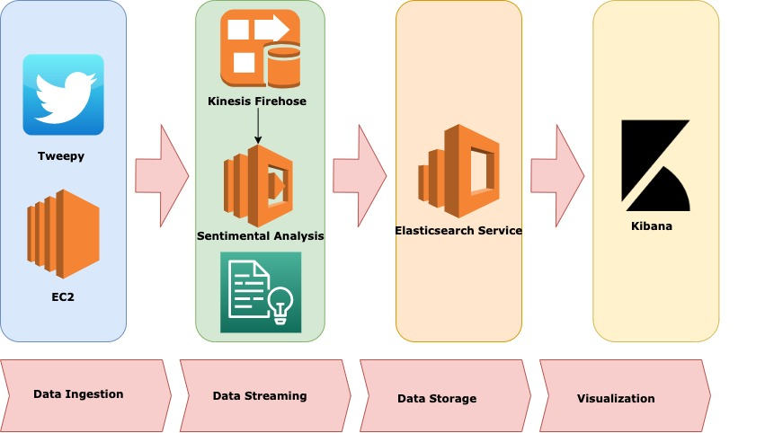
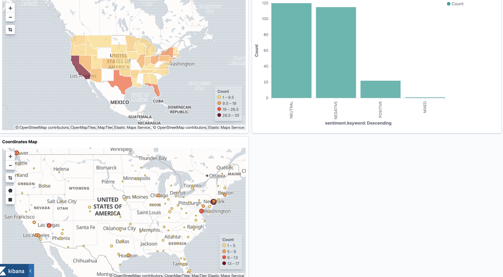
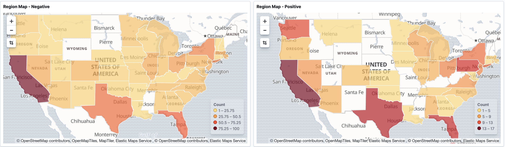

# Twitter Analysis: Creating a real-time data pipeline to analyze tweets

This project streams real-time data from Twitter, performs natural language processing on the contents of the tweet, and displays 
the results in a Kibana dashboard. The Twitter data is filtered by a query word and processed to determine sentiment of the tweet.

## What I Learned
- AWS services: EC2, Lambda, Comprehend, Kinesis Firehose
- Other tools: Elasticsearch and Kibana
- How to connect these services on AWS
- API Integration with Tweepy

## Design

## Technology

- AWS EC2: Web service that provides cloud computing
- AWS Kinesis Firehose: Prepares and loads real-time data streams 
- AWS Lambda: Serverless compute
- AWS Comprehend: Natural Language Processing 
- Amazon Elasticsearch service: Fully managed service that deploys, secures, and runs Elasticsearch
- Kibana: Open source analytics and visualizations platform designed to work with Elasticsearch

## Kibana Examples

## Author

- Jonathan Nocek - *jnocek@iwu.edu*

