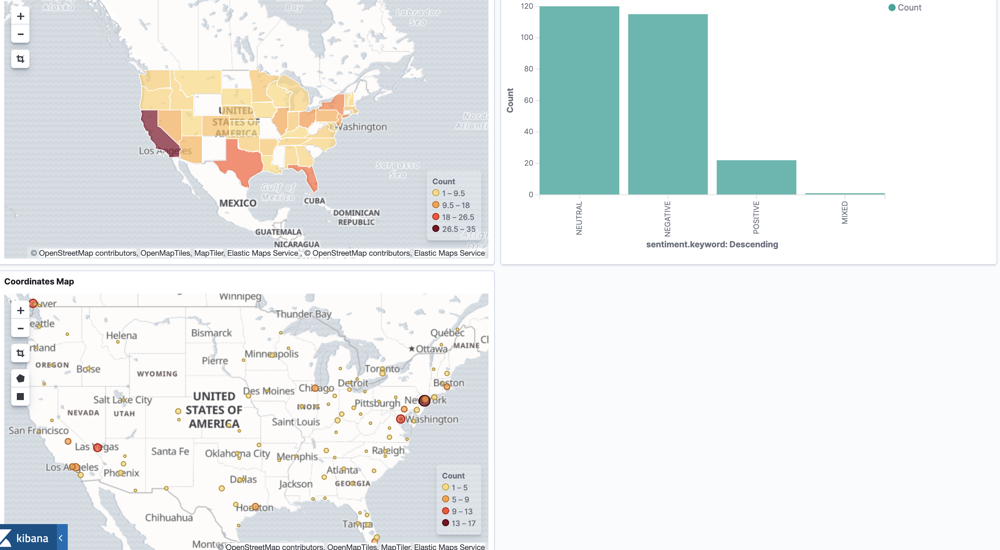
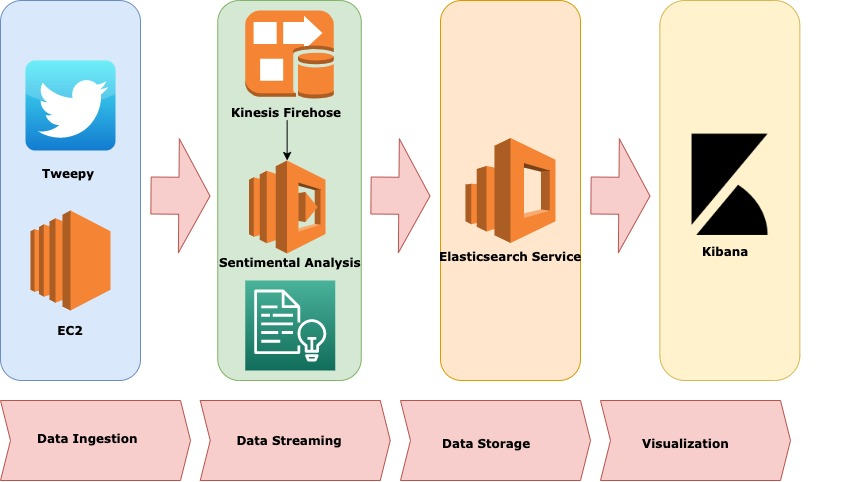

# Presentation 2: Week of January 26th

## Current State

The pipeline has been connected to the Kibana example. 



## System Design



## Example Output

From last week, I have expanded the data being outputted and sent to Kiban. Here is an example entry:
```
{
        "text": "so today i hit a Trump supporter in a car that wasn’t mine and i’ve never been more stressed🥵😭",
        "sentiment": "NEGATIVE",
        "score": -0.5409159101545811,
        "datetime": "2020-02-03T14:43:46",
        "username": "maddiwood1301",
        "place" : {
            "city": "New Orleans",
            "state": "LA"
        },
        "location" : {
            "latitude": 29.9499323,
            "longitude": -90.0701156
        }
    },
```


## Research Question

How popular are the 2020 Presidential candidates on Twitter?
- So far I have been only streaming for tweets containing 'Trump'


## Potential Exploration

- Map city, state to latitude/longitude coords so it can be used via a map
- Divide the streaming data by state and determine difference
- Use state data to do logsitic regression to determine red/blue state
- Potentially use old data from 2016 Presidential Election to train new model