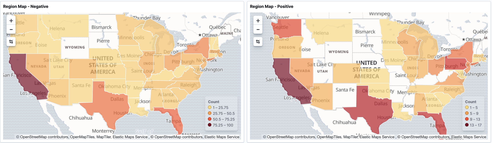
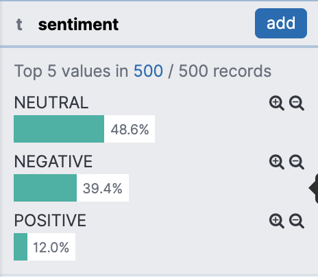

# Presentation 2: Week of January 26th

## Example Output

From last week, I have expanded the data being outputted and sent to Kibana. Here is an example entry:
```
{
        "text": "so today i hit a Trump supporter in a car that wasn’t mine and i’ve never been more stressed🥵😭",
        "sentiment": "NEGATIVE",
        "score": -0.5409159101545811,
        "datetime": "2020-02-03T14:43:46",
        "username": "maddiwood1301",
        "place" : {
            "city": "New Orleans",
            "state": "LA"
        },
        "location" : [29.9499323, -90.0701156]
    },
```

## Current State

Right now, the pipeline is functioning. I currently can launch an EC2 to listen to any tweets conatining a certain string,
then it will put into the data stream, ran through the lambda, and finally placed into Elasticsearch to be used in Kibana.



## Basic Analysis

There are constant tweets about President Trump with the tweets being overwhelmingly negative. I believe that people are more
likely to use Twitter when displeased as compared to being satisfied. I believe that a potential avenue for analysis is
determining which words can be the best predictors for a positive or negative tweet. 

## Research Question

How popular are the 2020 Presidential candidates on Twitter?
- So far I have been only streaming for tweets containing 'Trump'



## Future Exploration

- Expand search terms to include Democratic candidates like Biden, Sanders, etc.
- Determine if logistic regression can be used to classify state as Democratic or Republican
- See how Naive Bayes and other machine learning algs can be applied to the current problem
- Begin writing a report using LaTex
- Use an iPython notebook to create some visuals
- Learn how to save the tweets to a .csv or .json 

Other ideas:

- Potentially rethink research question: Use k-means clustering and machine learning to create recommendations
- Determine which words are the best predictors of a good tweet and which words are the best predictors of a negative tweet